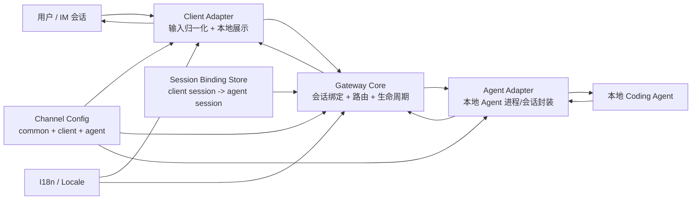

# 架构设计

这份文档用于帮助开发者在几分钟内理解 `agent-bridge` 的整体架构。

目标不是介绍实现细节，而是讲清楚这套系统的**分层方式、核心对象、运行时边界与设计取舍**。读完后，你应该能回答下面几个问题：

- `agent-bridge` 到底桥接了什么？
- 一条消息从 IM 到本地 Agent 是怎么流动的？
- 会话、命令、配置、语言这些能力分别放在哪一层？
- 如果以后扩展新的 client 或 agent，应该接入到哪里？

## 整体架构

一句话概括：

> `agent-bridge` 是一个“双适配器 + 单路由核心”的桥接系统：左边接 IM，右边接本地 Agent，中间由 `Gateway Core` 负责会话绑定、事件路由与运行时生命周期管理。

---

## 1. 设计目标

这套架构优先解决的是**“把一个本地 Agent 稳定地挂到一个 IM 渠道上”**，而不是做一个通用工作流平台。

因此它的设计重点是：

1. **桥接清晰**：输入从 IM 进入，输出回到 IM，中间链路尽量短。
2. **职责分层**：客户端展示、核心路由、Agent 封装分别独立。
3. **会话可控**：同一个聊天会话可以稳定绑定到某个 Agent 会话。
4. **扩展简单**：新增一个 client 或 agent 时，不需要重写整套系统。
5. **本地优先**：Agent 运行保持在本地环境，桥只负责接入与编排。

它**不追求**：

- 在 bridge 层实现复杂工作流编排
- 在 bridge 层维护业务插件系统
- 为不同平台做大量定制化语义分叉

---

## 2. 系统分成哪几层

## 2.1 Client Adapter 层

Client Adapter 负责面向 IM 平台，处理所有“渠道侧”的问题。

这一层的职责是：

- 接收平台消息
- 把平台输入归一化为统一事件
- 做少量本地可见能力
  - 例如帮助命令的本地回复
  - 例如最终消息、进度、附件的展示
- 把统一事件交给核心层
- 接收核心层回传的统一输出，并翻译成平台可发送的内容

可以把它理解为：

> “平台协议适配层 + 用户界面呈现层”

这里的关键词是**归一化**和**本地展示**，而不是业务决策。

相关入口通常在：

- `src/modules/client/`

## 2.2 Gateway Core 层

`Gateway Core` 是系统的中枢。

它不关心某个平台如何发消息，也不关心某个具体 Agent 如何启动命令行进程；它只关心：

- 当前这个 client session 该路由到哪个 agent session
- 什么时候创建新 agent session
- 什么时候复用旧 session
- 什么时候释放空闲 session
- 什么命令应当交给 agent，什么命令应当直接由桥处理
- agent 输出回来后，应该投递给哪个 client session

可以把它理解为：

> “会话路由器 + 生命周期管理器”

相关位置通常在：

- `src/core/gateway-core.ts`
- `src/core/channel-runner.ts`

## 2.3 Agent Adapter 层

Agent Adapter 负责把“某种本地 Agent”包装成统一接口。

这一层的职责是：

- 创建或恢复 agent session
- 接收统一输入事件
- 将本地 Agent 的输出转成统一输出事件
- 暴露运行状态，例如是否忙碌、是否支持中断

可以把它理解为：

> “本地 Agent 的协议翻译层”

这样做的意义是：核心层不需要知道具体 Agent 的实现方式，只需要知道它满足统一会话契约。

相关入口通常在：

- `src/modules/agent/`

---

## 3. 核心设计对象

## 3.1 Channel

`Channel` 是系统的运行单位。

一个 channel 表示：

- 一套公共配置
- 一个 client 模块实例
- 一个 agent 模块实例
- 一组独立的会话绑定关系

也就是说，系统不是“全局只跑一个桥”，而是“按 channel 独立运行”。

这样带来的好处是：

- 不同渠道配置互不干扰
- 不同语言可以按 channel 配置
- 不同 client / agent 组合可以并行存在

## 3.2 Common / Client / Agent 三段配置

每个 channel 的配置被分成三类：

### Common

公共配置，描述这个 channel 的共享上下文。

典型内容：

- channel 名称
- 语言

它是整个运行时都会用到的上下文，而不是只属于 client 或 agent。

### Client Config

描述 IM 侧连接和行为所需的配置。

### Agent Config

描述本地 Agent 侧启动和运行所需的配置。

这三段配置的拆分，体现了一个核心设计：

> “公共上下文放 common，接入侧细节放 client/agent，各层只拿自己需要的那部分。”

## 3.3 Client Session 与 Agent Session

这是整个系统最关键的抽象。

### Client Session

表示 IM 侧的一段会话身份。

它回答的问题是：

- 这条用户消息来自哪个聊天上下文？

### Agent Session

表示 Agent 侧的一段可持续上下文。

它回答的问题是：

- 本地 Agent 应该延续哪段历史上下文？

### 绑定关系

`Gateway Core` 维护：

- `client session -> agent session`

这意味着：

- 用户在同一个聊天里继续发消息时，默认会复用已有 agent 上下文
- 用户执行 `/new` 这类会话命令时，绑定关系会切换到新的 agent session

这个绑定关系还会持久化保存，因此 bridge 重启后仍有机会恢复原先的会话映射。

---

## 4. 一条消息是怎么流动的

下面是最典型的运行路径。

## 4.1 用户发送普通消息

1. 用户在 IM 中发出一条消息
2. Client Adapter 接收平台事件
3. Client Adapter 把输入归一化为统一的 `ClientOutputEvent`
4. `Gateway Core` 根据 `client session` 找到或创建对应的 `agent session`
5. Core 将统一输入发送给 Agent Adapter
6. Agent Adapter 驱动本地 Agent 执行
7. Agent 输出被 Agent Adapter 转成统一的 `AgentOutputEvent`
8. `Gateway Core` 将输出重新路由回原来的 `client session`
9. Client Adapter 把输出展示为 IM 消息、进度或附件

系统的关键点不在“转发”，而在“**带着正确的会话身份转发**”。

## 4.2 用户发送会话命令

会话命令分两类：

### 本地命令

例如帮助命令。

它的目标是给用户返回桥自身的使用说明，因此由 Client Adapter 本地处理即可，不进入核心路由，也不调用 Agent。

### 核心命令

例如新建会话、压缩上下文、停止运行。

这类命令会被标准化后送到 `Gateway Core`，由核心决定：

- 是否需要新建 session
- 是否应该转发给当前 agent
- 如果当前没有活动 session，应该返回什么系统说明

这体现的是一个重要边界：

> 与“聊天界面帮助”相关的内容留在 client；与“会话状态变化”相关的内容进入 core。

---

## 5. 生命周期设计

## 5.1 Channel 生命周期

一个 channel 的启动过程，本质上是：

1. 读取配置
2. 选择 client module 和 agent module
3. 构造公共上下文
4. 创建 Client Adapter
5. 创建 `Gateway Core`
6. 启动整个消息桥接链路

停止 channel 时，则按反方向关闭运行时资源。

## 5.2 Agent Runtime 生命周期

对于 Core 来说，Agent 不是一个全局单例，而是一组**按需创建的 runtime**。

每个 runtime 都至少包含：

- 一个 agent session 身份
- 一个绑定的 client session
- 一个 agent adapter 实例
- 一份活跃时间信息

它的生命周期规则是：

- 有消息时创建或恢复
- 使用中持续刷新活跃时间
- 空闲过久且不忙碌时自动释放

这样做的目的有两个：

1. **节省本地资源**：不必让所有 Agent 会话永久驻留
2. **保持聊天连续性**：只要还在活跃窗口内，就尽量复用已有上下文

## 5.3 重启恢复

系统会保存 client 与 agent 的绑定关系。

因此在 bridge 重启后，Core 可以优先尝试恢复既有 agent session，而不是总是从空白上下文重新开始。

这使 bridge 更像一个“稳定的会话入口”，而不是一次性的消息转发器。

---

## 6. 事件驱动设计

`agent-bridge` 的内部不是直接把“平台消息对象”互相传来传去，而是先转换成统一事件。

这么做的价值在于：

- Core 不依赖某个平台的数据结构
- Agent 侧不依赖 IM 平台的数据结构
- Client 与 Agent 都可以围绕稳定契约扩展

从职责上看，系统中有两组主要事件流：

### Client -> Core

由 Client Adapter 发出的统一输入事件，表达：

- 用户说了一句话
- 用户触发了会话命令

### Agent -> Core -> Client

由 Agent Adapter 发出的统一输出事件，表达：

- 最终回复
- 处理中状态
- 工具调用进度
- 压缩状态
- 附件输出

这使得 Core 成为一个稳定的事件交换中心，而不是某个平台 SDK 的直通管道。

---

## 7. 命令系统的设计位置

命令系统不是单独做成一个“命令服务”，而是作为消息入口的一部分存在。

设计上分成两段：

## 7.1 本地帮助命令

帮助命令属于**界面辅助能力**。

它的特点是：

- 不影响会话绑定
- 不影响 Agent 状态
- 只需要给用户回一段固定说明

因此它放在 Client Adapter 一侧处理。

## 7.2 会话控制命令

例如：

- 新建会话
- 压缩上下文
- 停止当前运行

这类命令会改变系统状态或触发 agent 行为，因此统一由 `Gateway Core` 负责。

相关详细说明可见：

- `docs/command-system.md`

---

## 8. 多语言设计

多语言不是某个 adapter 的私有能力，而是 channel 的公共能力。

因此语言配置被放在 `common` 中，并在运行时传递给：

- Client Adapter
- `Gateway Core`
- Agent Module / Agent Adapter

这样设计有几个好处：

1. **语言归属清晰**：这是 channel 的属性，而不是某个平台 SDK 的属性
2. **文案一致**：本地帮助、系统提示、进度说明都能共享同一种语言
3. **并发安全**：不同 channel 可以各自使用不同语言，而不会互相污染

从架构角度看，多语言能力本质上是：

> “给整个 channel 注入一个固定语言上下文，然后由各层按需取用。”

相关位置通常在：

- `src/i18n/`

---

## 9. 进度与最终回复为什么分开

在桥接场景里，“用户看到什么”并不只有最终答案，还包括中间状态。

因此统一输出事件中，进度和最终消息被有意区分开：

- 最终消息：用户真正要消费的回答
- 进度事件：帮助用户理解当前 Agent 正在做什么

这种设计让系统既能支持非常轻量的 client，也能支持更丰富的动态展示，而不需要改变 Core 的基本路由逻辑。

换句话说：

> Core 负责转发“语义化输出”，展示层再决定如何把这些语义渲染给用户。

---

## 10. 模块扩展设计

系统采用注册式模块结构：

- Client Modules 统一注册
- Agent Modules 统一注册
- Channel 配置通过 `type` 选择模块

这意味着扩展新模块时，通常不需要改动核心路由模型，只需要满足统一契约。

### 新增一个 Client 模块时

你需要提供的是：

- 配置收集与校验
- 平台输入到统一事件的归一化
- 统一输出到平台展示的映射

### 新增一个 Agent 模块时

你需要提供的是：

- 创建/恢复 session 的能力
- 接收统一输入事件
- 产出统一输出事件
- 暴露忙碌状态与可选中断能力

扩展的关键不是“接入更多功能”，而是“继续遵守统一边界”。

---

## 11. 为什么要坚持这些边界

这套架构里最重要的不是某一个类，而是几个边界始终不混：

### 边界一：平台边界

平台相关问题停留在 Client Adapter，不泄露到 Core。

### 边界二：Agent 边界

Agent 进程或 SDK 的具体行为停留在 Agent Adapter，不泄露到 Core。

### 边界三：状态边界

会话绑定、生命周期、空闲释放由 Core 统一维护，不分散到 adapter。

### 边界四：文案边界

语言属于 channel 的公共上下文，不散落为各处的临时状态。

正是因为这些边界稳定，`agent-bridge` 才能保持“结构很小，但扩展不乱”。

---

## 12. 五分钟总结

如果你只记住下面几点，就已经掌握了这套架构的大部分：

1. `agent-bridge` 是 **Client Adapter -> Gateway Core -> Agent Adapter** 的三层桥接结构。
2. **Client Adapter** 负责平台接入与本地展示，**Agent Adapter** 负责本地 Agent 封装。
3. **Gateway Core** 是中枢，负责会话绑定、命令路由、生命周期与输出回投。
4. 系统的关键抽象不是“消息”，而是 **client session 与 agent session 的绑定关系**。
5. 命令分两类：**本地帮助留在 client**，**会话控制进入 core**。
6. 语言是 **channel 级公共上下文**，不是某一侧的私有配置。
7. 扩展新模块时，优先遵守统一事件契约和分层边界，而不是把逻辑塞进 Core。

如果需要继续深入，建议下一步按这个顺序阅读：

1. 本文档：整体架构
2. `docs/command-system.md`：命令设计
3. `src/types.ts`：统一契约
4. `src/core/gateway-core.ts`：核心路由与生命周期
5. `src/modules/client/` 与 `src/modules/agent/`：模块接入方式
