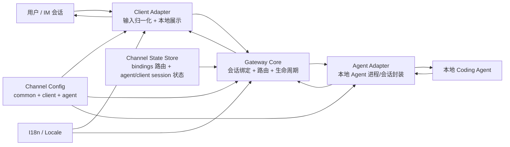

# 架构设计

这份文档用于帮助开发者在几分钟内理解 `agent-bridge` 的整体架构。

目标不是介绍实现细节，而是讲清楚这套系统的**分层方式、核心对象、运行时边界与设计取舍**。读完后，你应该能回答下面几个问题：

- `agent-bridge` 到底桥接了什么？
- 一条消息从 IM 到本地 Agent 是怎么流动的？
- 会话、命令、配置、语言这些能力分别放在哪一层？
- 如果以后扩展新的 client 或 agent，应该接入到哪里？

## 整体架构


```mermaid
flowchart LR
    U[用户 / IM 会话] --> C[Client Adapter\n输入归一化 + 本地展示]
    C --> G[Gateway Core\n会话绑定 + 路由 + 生命周期]
    G --> A[Agent Adapter\n本地 Agent 进程/会话封装]
    A --> P[本地 Coding Agent]

    P --> A
    A --> G
    G --> C
    C --> U

    CFG[Channel Config\ncommon + client + agent] --> C
    CFG --> G
    CFG --> A

    BIND[Channel State Store\nbindings 路由 + agent/client session 状态] --> G
    I18N[I18n / Locale] --> C
    I18N --> G
```

一句话概括：

> `agent-bridge` 是一个“双适配器 + 单路由核心”的桥接系统：左边接 IM，右边接本地 Agent，中间由 `Gateway Core` 负责会话绑定、事件路由与运行时生命周期管理。

---

## 1. 设计目标

这套架构优先解决的是**“把一个本地 Agent 稳定地挂到一个 IM 渠道上”**，而不是做一个通用工作流平台。

因此它的设计重点是：

1. **桥接清晰**：输入从 IM 进入，输出回到 IM，中间链路尽量短。
2. **职责分层**：客户端展示、核心路由、Agent 封装分别独立。
3. **会话可控**：同一个聊天会话可以稳定绑定到某个 Agent 会话。
4. **扩展简单**：新增一个 client 或 agent 时，不需要重写整套系统。
5. **本地优先**：Agent 运行保持在本地环境，桥只负责接入与编排。

它**不追求**：

- 在 bridge 层实现复杂工作流编排
- 在 bridge 层维护业务插件系统
- 为不同平台做大量定制化语义分叉

---

## 2. 系统分成哪几层

## 2.1 Client Adapter 层

Client Adapter 负责面向 IM 平台，处理所有“渠道侧”的问题。

这一层的职责是：

- 接收平台消息
- 把平台输入归一化为统一事件
- 做少量本地可见能力
  - 例如帮助命令的本地回复
  - 例如状态查询结果的本地渲染
  - 例如模型列表 / 模型切换结果的本地渲染
  - 例如最终消息、进度、附件的展示
- 把统一事件交给核心层
- 接收核心层回传的统一输出，并翻译成平台可发送的内容

可以把它理解为：

> “平台协议适配层 + 用户界面呈现层”

这里的关键词是**归一化**和**本地展示**，而不是业务决策。

相关入口通常在：

- `src/modules/client/`

## 2.2 Gateway Core 层

`Gateway Core` 是系统的中枢。

它不关心某个平台如何发消息，也不关心某个具体 Agent 如何启动命令行进程；它只关心：

- 当前这个 client session 该路由到哪个 agent session
- 什么时候创建新 agent session
- 什么时候复用旧 session
- 什么时候释放空闲 session
- 什么命令应当路由到 agent runtime
- agent 输出回来后，应该投递给哪个 client session
- 生成 bridge agent session id（`<moduleType>:<uuid>`），并负责 agent session 记录的生命周期：创建 / 恢复 / 切换 / 空闲释放 / 停止，创建失败时回滚删除新记录而不影响既有会话

可以把它理解为：

> “会话路由器 + 生命周期管理器”

相关位置通常在：

- `src/core/gateway-core.ts`
- `src/core/channel-runner.ts`

## 2.3 Agent Adapter 层

Agent Adapter 负责把“某种本地 Agent”包装成统一接口。

这一层的职责是：

- 创建或恢复 agent session
- 接收统一输入事件
- 将本地 Agent 的输出转成统一输出事件
- 暴露运行状态，例如是否忙碌、是否支持中断

可以把它理解为：

> “本地 Agent 的协议翻译层”

这样做的意义是：核心层不需要知道具体 Agent 的实现方式，只需要知道它满足统一会话契约。

相关入口通常在：

- `src/modules/agent/`

---

## 3. 核心设计对象

## 3.1 Channel

`Channel` 是系统的运行单位。

一个 channel 表示：

- 一套公共配置
- 一个 client 模块实例
- 一个 agent 模块实例
- 一组独立的会话绑定关系

也就是说，系统不是“全局只跑一个桥”，而是“按 channel 独立运行”。

这样带来的好处是：

- 不同渠道配置互不干扰
- 不同语言可以按 channel 配置
- 不同 client / agent 组合可以并行存在

## 3.2 Common / Client / Agent 三段配置

每个 channel 的配置被分成三类：

### Common

公共配置，描述这个 channel 的共享上下文。

典型内容：

- channel 名称
- 语言

它是整个运行时都会用到的上下文，而不是只属于 client 或 agent。

### Client Config

描述 IM 侧连接和行为所需的配置。

### Agent Config

描述本地 Agent 侧启动和运行所需的配置。

这三段配置的拆分，体现了一个核心设计：

> “公共上下文放 common，接入侧细节放 client/agent，各层只拿自己需要的那部分。”

## 3.3 Client Session 与 Agent Session

这是整个系统最关键的抽象。

### Client Session

表示 IM 侧的一段会话身份。

它回答的问题是：

- 这条用户消息来自哪个聊天上下文？

### Agent Session

表示 Agent 侧的一段可持续上下文。

它回答的问题是：

- 本地 Agent 应该延续哪段历史上下文？

### 绑定关系

`Gateway Core` 维护：

- `client session -> agent session`

这意味着：

- 用户在同一个聊天里继续发消息时，默认会复用已有 agent 上下文
- 用户执行 `/new` 这类会话命令时，绑定关系会切换到新的 agent session

这个绑定关系还会持久化保存，因此 bridge 重启后仍有机会恢复原先的会话映射。

#### 绑定是纯路由

绑定只是 `clientSessionId -> agentSessionId` 的**纯路由映射**，不携带任何 Agent 侧元数据：

- 工作目录、provider session id 等 Agent 侧信息**不在**绑定里
- 它们存放在同一个 channel 状态文件的 `agentSessions` 记录中，由对应的 Agent 模块（adapter）自己读写

#### Bridge Agent Session ID 与 provider id 解耦

新会话使用 Core 生成的 **bridge agent session id**（`<moduleType>:<uuid>` 形式）：

- Core 不关心 provider 侧的会话 id 长什么样
- provider id（例如 OpenCode Server 的 session id）只存在于 adapter 自己的状态里；adapter 在 `resume` 时从状态读回，而不是从 bridge id 里推断
- 唯一的例外是 legacy 迁移路径：旧的 `opencode:<providerId>` 前缀 id 在自动迁移时，其 provider id 会被推导出来放进迁移后的状态记录

#### 持久化：每个 channel 一个状态文件

每个 channel 的持久化状态保存在**同一个 JSON 文件**里：

```text
~/.config/agent-bridge/session-bindings/<encoded-channel-name>.json
```

注意：目录名仍叫 `session-bindings`（历史遗留命名），但文件内容已经是 v3 channel 状态文档，而不是旧的绑定表。

文档结构（`ChannelPersistentState` v3）：

- `bindings`：纯路由映射 `clientSessionId -> agentSessionId`
- `agentSessions`：以 agent session id 为 key 的 `AgentSessionRecord` 信封，包含 `agentType`、`stateVersion`、`createdAt`/`updatedAt` 与 opaque 的 `state` 载荷
- `clientSessions`：以 client session id 为 key 的 `ClientSessionRecord` 信封，包含 `clientType`、`stateVersion`、`createdAt`/`updatedAt` 与 opaque 的 `state` 载荷（例如该聊天记住的 `/new` 默认工作目录）

写入是原子的（同目录临时文件 + rename），并且 bindings、agent 状态与 client 状态的所有写入共享同一条 FIFO 事务队列，任何两个写入者都不会互相覆盖。

旧的 `SessionBindingStore` 门面仍然保留为兼容层：读取时从 `agentSessions` 记录重建 `{ agentSessionId, workingDirectory }` 视图，保存时把 workingDirectory 回填进迁移记录。

#### 自动迁移

加载时（`load`）自动识别并迁移这些 legacy schema：

1. v2 版本化文档（没有 `clientSessions`）：在内存中补上空的 `clientSessions` 映射
2. 旧字符串绑定：`Record<clientId, agentSessionId>`（纯字符串值）
3. 旧对象绑定：`Record<clientId, { agentSessionId, workingDirectory? }>`
4. 未知 agent id 前缀的绑定：路由绑定**保留**，但不会为无法推断模块类型的 id 伪造记录

迁移在内存中完成（加载时不做写回，下一次写入会持久化规范化后的文档）；被丢弃的损坏条目、被跳过的记录、共享 agent 的 workingDirectory 冲突都会记录在迁移报告中。带顶层 `version` 键但不是受支持版本号的文档会被直接拒绝（fail-safe），不会被误当成 legacy 绑定表。

#### 状态所有权模型

Agent session 状态的所有权是分离的：

- **Core / Registry**（`AgentSessionStateRegistry`）负责记录生命周期：
  - `reserve`：为新 session 预留创建句柄（失败会清理）
  - `open`：打开已有 session 的读写句柄（校验 agentType 与状态可解码性）
  - `revoke`：失效所有活句柄，但保留持久化记录，之后可再次 `open`
  - `delete`：失效句柄并删除持久化记录（幂等）
  - 附带的 generation 计数器保证在途的 `reserve`/`open` 不会拿到已被失效的句柄
- **Agent Module / Adapter** 拿到的是 scoped 句柄（`AgentSessionStateApi` / `NewAgentSessionStateApi`），只能访问自己的那一个 agent session：
  - `initialize`：创建阶段一次性写入记录（只能调用一次）
  - `read` / `replace` / `update`：读取、整体替换、原子读改写
  - `flush`：等待 pending 写入落盘
  - adapter **看不到**其它 agent session，也**不能**删除记录
- 每个模块提供一个 `AgentSessionStateCodec<T>`：`encode` 与 `decode` 都做严格运行时校验，持久化载荷必须是 JSON 兼容的，并带 `stateVersion`

adapter 在 `start()` 内完成状态的所有权动作：

- **create**：解析 / 校验工作目录（Pi 做 `realpath` 规范化，OpenCode 只做词法校验），随后 `initialize` 写入状态记录
- **resume**：从打开的句柄 `read` 回状态，重新校验并（必要时）改写成规范形态（例如把 legacy 迁移标记改写成正式 V1 记录）

`AgentModule.resumeAgentSession` 是**必需**能力：Core 从不读取 adapter 拥有的状态（例如工作目录）来猜测如何恢复会话，模块必须自己从 `sessionState` 里读。

#### Client Session Store

Client 侧有一个与 Agent 侧镜像、但更简单的状态存储（`ClientSessionStateStore`）：

- **每个 channel 一个 store**，由 `channel-runner` 用同一个 channel 状态文件构建，记录落在文档的 `clientSessions` 段里
- **Client Module** 提供一个 `ClientSessionStateCodec<T>`（与 agent codec 同样的版本化、JSON 兼容、严格校验约定），store 在创建时就绑定模块的 `clientType` 与 codec
- **Client Adapter** 在 `createClientAdapter` 里拿到 store，按需取出 scoped 句柄 `ClientSessionStateApi`（`read` / `update` / `flush`），只能访问自己那一个 client session
- 与 agent session 不同，client session **没有显式生命周期**（一个聊天第一次发消息就存在），所以没有 reserve/revoke/delete：`read` 在无记录时返回 `undefined`，首次 `update` 懒创建记录；类型不匹配（例如 channel 换了 client 类型）会拒绝读写而不是误用
- 典型用途：`/new <path>` 把用户显式传入且通过本地校验的目录记为该聊天的 `defaultWorkingDirectory`（canonical 形态），之后不带参数的 `/new` 复用它；store 故障只会降级为回退路径，不会阻断命令本身

---

## 4. 一条消息是怎么流动的

下面是最典型的运行路径。

## 4.1 用户发送普通消息

1. 用户在 IM 中发出一条消息
2. Client Adapter 接收平台事件
3. Client Adapter 把输入归一化为统一的 `ClientOutputEvent`
4. `Gateway Core` 根据 `client session` 找到或创建对应的 `agent session`
5. Core 将统一输入发送给 Agent Adapter
6. Agent Adapter 驱动本地 Agent 执行
7. Agent 输出被 Agent Adapter 转成统一的 `AgentOutputEvent`
8. `Gateway Core` 将输出重新路由回原来的 `client session`
9. Client Adapter 把输出展示为 IM 消息、进度或附件

系统的关键点不在“转发”，而在“**带着正确的会话身份转发**”。

## 4.2 用户发送会话命令

会话命令分两类：

### 本地命令

例如帮助命令。

它的目标是给用户返回桥自身的使用说明，因此由 Client Adapter 本地处理即可，不进入核心路由，也不调用 Agent。

### 运行时命令

例如新建会话、压缩上下文、停止运行、查询当前状态、查询可用模型、切换当前模型。

这类命令会被标准化后送到 `Gateway Core`，由核心负责：

- 找到当前 client session 对应的 agent session
- 把命令路由给正确的 agent runtime
- 在 runtime 不可用时返回结构化兜底结果

这里有一个关键边界：

- `Gateway Core` 负责**路由与兜底**
- `Agent Adapter` 负责**提供结构化运行时信息**
- `Client Adapter` 负责**把结构化结果渲染成用户可见输出**

这体现的是一个重要边界：

> 与“聊天界面帮助”相关的内容留在 client；与“会话状态变化”相关的内容进入 core；与“如何展示状态”相关的内容仍然留在 client。

---

## 5. 生命周期设计

## 5.1 Channel 生命周期

一个 channel 的启动过程，本质上是：

1. 读取配置
2. 选择 client module 和 agent module
3. 构造公共上下文
4. 创建 Client Adapter
5. 创建 `Gateway Core`
6. 启动整个消息桥接链路

停止 channel 时，则按反方向关闭运行时资源。

## 5.2 Agent Runtime 生命周期

对于 Core 来说，Agent 不是一个全局单例，而是一组**按需创建的 runtime**。

每个 runtime 都至少包含：

- 一个 agent session 身份
- 一个绑定的 client session
- 一个 agent adapter 实例
- 一份活跃时间信息

它的生命周期规则是：

- 有消息时创建或恢复
- 使用中持续刷新活跃时间
- 空闲过久且不忙碌时自动释放

这样做的目的有两个：

1. **节省本地资源**：不必让所有 Agent 会话永久驻留
2. **保持聊天连续性**：只要还在活跃窗口内，就尽量复用已有上下文

## 5.3 重启恢复

系统把每个 channel 的绑定关系与 agent session 状态保存在同一个 channel 状态文件里（详见 3.3）。

因此在 bridge 重启后，Core 可以优先尝试恢复既有 agent session，而不是总是从空白上下文重新开始：先从 `bindings` 还原路由，再从 `agentSessions` 找到记录并打开 scoped 状态句柄交给 adapter 恢复。旧版本文档（纯字符串绑定、带 `workingDirectory` 的对象绑定）在加载时自动迁移。

这使 bridge 更像一个“稳定的会话入口”，而不是一次性的消息转发器。

---

## 6. 事件驱动设计

`agent-bridge` 的内部不是直接把“平台消息对象”互相传来传去，而是先转换成统一事件。

这么做的价值在于：

- Core 不依赖某个平台的数据结构
- Agent 侧不依赖 IM 平台的数据结构
- Client 与 Agent 都可以围绕稳定契约扩展

从职责上看，系统中有两组主要事件流：

### Client -> Core

由 Client Adapter 发出的统一输入事件，表达：

- 用户说了一句话
- 用户触发了会话命令

### Agent -> Core -> Client

由 Agent Adapter 发出的统一输出事件，表达：

- 最终回复
- 处理中状态
- 工具调用进度
- 压缩状态
- 结构化会话状态
- 结构化模型列表
- 结构化模型切换结果
- 结构化错误
- 附件输出

这使得 Core 成为一个稳定的事件交换中心，而不是某个平台 SDK 的直通管道。

---

## 7. 命令系统的设计位置

命令系统不是单独做成一个“命令服务”，而是作为消息入口的一部分存在。

设计上分成两段：

## 7.1 本地帮助命令

帮助命令属于**界面辅助能力**。

它的特点是：

- 不影响会话绑定
- 不影响 Agent 状态
- 只需要给用户回一段固定说明

因此它放在 Client Adapter 一侧处理。

## 7.2 会话控制命令

例如：

- 新建会话
- 压缩上下文
- 停止当前运行
- 查询当前运行时状态
- 查询可用模型
- 切换当前模型

这类命令会改变系统状态、读取运行时状态，或触发 agent 行为，因此统一由 `Gateway Core` 负责路由。

其中 `/status` 和 `/model` 都比较特殊：

- 它们不是普通用户消息
- 它们也不是本地帮助
- 它们本质上是**运行时查询 / 运行时控制命令**

因此它们采用的不是“模型回答”路径，而是：

- Client Adapter 发送结构化 command
- `Gateway Core` 查找当前 active runtime
- Agent Adapter 通过专门的查询 / 设置接口返回结构化结果
- Client Adapter 将结构化结果渲染为 markdown / 文本

`/model` 进一步分成两个动作：

- `/model`：查询当前 active session 的可用模型列表
- `/model provider/modelId`：切换当前 active session 模型

其中模型切换不会在 runtime 正忙时排队执行，而是直接返回一个结构化 busy 错误，避免和正在进行的推理或工具调用竞争。

相关详细说明可见：

- `docs/command-system.md`

---

## 8. 多语言设计

多语言不是某个 adapter 的私有能力，而是 channel 的公共能力。

因此语言配置被放在 `common` 中，并在运行时传递给：

- Client Adapter
- `Gateway Core`
- Agent Module / Agent Adapter

这样设计有几个好处：

1. **语言归属清晰**：这是 channel 的属性，而不是某个平台 SDK 的属性
2. **文案一致**：本地帮助、系统提示、进度说明都能共享同一种语言
3. **并发安全**：不同 channel 可以各自使用不同语言，而不会互相污染

从架构角度看，多语言能力本质上是：

> “给整个 channel 注入一个固定语言上下文，然后由各层按需取用。”

相关位置通常在：

- `src/i18n/`

---

## 9. 进度与最终回复为什么分开

在桥接场景里，“用户看到什么”并不只有最终答案，还包括中间状态。

因此统一输出事件中，进度和最终消息被有意区分开：

- 最终消息：用户真正要消费的回答
- 进度事件：帮助用户理解当前 Agent 正在做什么

这种设计让系统既能支持非常轻量的 client，也能支持更丰富的动态展示，而不需要改变 Core 的基本路由逻辑。

换句话说：

> Core 负责转发“语义化输出”，展示层再决定如何把这些语义渲染给用户。

---

## 10. 模块扩展设计

系统采用注册式模块结构：

- Client Modules 统一注册
- Agent Modules 统一注册
- Channel 配置通过 `type` 选择模块

这意味着扩展新模块时，通常不需要改动核心路由模型，只需要满足统一契约。

### 新增一个 Client 模块时

你需要提供的是：

- 配置收集与校验
- 平台输入到统一事件的归一化
- 统一输出到平台展示的映射

### 新增一个 Agent 模块时

你需要提供的是：

- 创建/恢复 session 的能力
- 接收统一输入事件
- 产出统一输出事件
- 暴露忙碌状态与可选中断能力

扩展的关键不是“接入更多功能”，而是“继续遵守统一边界”。

---

## 11. 为什么要坚持这些边界

这套架构里最重要的不是某一个类，而是几个边界始终不混：

### 边界一：平台边界

平台相关问题停留在 Client Adapter，不泄露到 Core。

### 边界二：Agent 边界

Agent 进程或 SDK 的具体行为停留在 Agent Adapter，不泄露到 Core。

### 边界三：状态边界

路由绑定、记录生命周期与空闲释放由 Core 统一维护；Agent 侧会话状态（工作目录、provider session id 等）封装在 `agentSessions` 记录里，由 adapter 通过 scoped 句柄自己读写，双方用版本化、JSON 兼容的 codec 交接，互不越界。

### 边界四：文案边界

语言属于 channel 的公共上下文，不散落为各处的临时状态。

正是因为这些边界稳定，`agent-bridge` 才能保持“结构很小，但扩展不乱”。

---

## 12. 五分钟总结

如果你只记住下面几点，就已经掌握了这套架构的大部分：

1. `agent-bridge` 是 **Client Adapter -> Gateway Core -> Agent Adapter** 的三层桥接结构。
2. **Client Adapter** 负责平台接入与本地展示，**Agent Adapter** 负责本地 Agent 封装。
3. **Gateway Core** 是中枢，负责会话绑定、命令路由、生命周期与输出回投。
4. 系统的关键抽象不是“消息”，而是 **client session 与 agent session 的绑定关系**——绑定只是纯路由，Agent 侧状态由 adapter 通过 scoped 句柄自持。
5. 命令分两类：**本地帮助留在 client**，**会话控制进入 core**。
6. 语言是 **channel 级公共上下文**，不是某一侧的私有配置。
7. 扩展新模块时，优先遵守统一事件契约和分层边界，而不是把逻辑塞进 Core。

如果需要继续深入，建议下一步按这个顺序阅读：

1. 本文档：整体架构
2. `docs/command-system.md`：命令设计
3. `src/types.ts`：统一契约
4. `src/core/gateway-core.ts`：核心路由与生命周期
5. `src/modules/client/` 与 `src/modules/agent/`：模块接入方式
