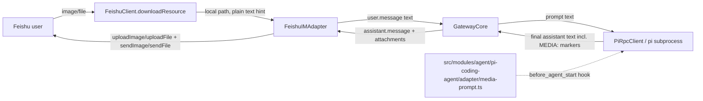

# Bidirectional Attachment Transfer Spec (Images & Files)

## Goal

Let a Feishu chat and its bound Pi agent session exchange images and files in both directions, on top of the existing text-only bridge:

- **Inbound**: a user sends an image/file in Feishu → the agent can see a local path to it and act on it.
- **Outbound**: the agent produces or wants to share a local image/file → it is uploaded and delivered as a native Feishu attachment.

This iteration includes:

- Feishu inbound resource download (image/file/audio/video → local temp path)
- Feishu outbound upload + send (image/file)
- A text convention (`MEDIA:<path>`) the agent uses to trigger outbound delivery
- A Pi extension that injects the `MEDIA:` convention into the system prompt
- Safety guards against false-positive marker matches and session/state bloat

This iteration does not include:

- A synchronous "tool call" that blocks the model's turn on upload/delivery confirmation (see "Rejected Alternatives")
- Passing inbound images to Pi as structured `ImageContent` (base64) (see "Rejected Alternatives")
- Non-Feishu channels (Telegram/Slack/etc.) — the design is channel-agnostic but only Feishu is implemented now
- Card-message or rich-embed delivery of attachments

## Non-Goals

- No changes to `GatewayCore` session-binding/idle-timeout semantics.
- No changes to the Pi RPC command surface (`prompt`/`abort`/`compact`/...).
- No new client-facing slash commands.
- No attempt to reimplement Pi's own `APPEND_SYSTEM.md` discovery or project-trust logic outside of Pi itself.

## Background: Key Findings From Investigation

These findings shaped every design decision below and must not be relitigated without re-verifying them against the installed `@earendil-works/pi-coding-agent` version:

1. **Pi's RPC protocol has no "register a tool" command.** The only way to add an LLM-callable tool is `--extension <path>` (confirmed via `pi --help` and the full `RpcCommand` union type). Extensions can be loaded per-invocation, so this does not require global `pi install`.
2. **The RPC layer's only extension→host request/response channel is `extension_ui_request` / `extension_ui_response`**, a fixed enum of UI dialog methods (`select`/`confirm`/`input`/`editor`/`notify`/`setStatus`/`setWidget`/`setTitle`/`set_editor_text`). There is no generic custom-data channel over the RPC stdio protocol.
3. **`SessionMessageEntry.content` in Pi's session store is typed as `string | (TextContent | ImageContent)[]`**, i.e. `ImageContent.data` (base64) is persisted verbatim into the session JSONL file if passed via the `prompt` RPC command's `images` field. Pi's `ImageSettings` (`autoResize`/`blockImages`) only affects what is sent to the model, not what gets persisted.
4. **Hermes hit this exact failure mode and fixed it** by normalizing multimodal content to a text summary before persisting (`agent/agent_runtime_helpers.py`, `run_agent.py`): "base64 images would bloat the session DB" / "avoid embedding ~1MB base64 blobs into every saved trajectory." Agent-bridge has no equivalent hook into Pi's internal session writer, so it cannot apply the same fix — the only safe option is to never put base64 into the `images` RPC field to begin with.
5. **Hermes's own `MEDIA:<path>` marker convention (`gateway/platforms/base.py`) is not anchored to line start** — the marker can appear mid-sentence. This required defensive masking of fenced code blocks / inline code / blockquotes (`_mask_protected_spans`) and of `MEDIA:` text embedded in echoed JSON tool-result strings (`_mask_json_string_media`), plus two real regressions to learn from: #34517 (strip-regex and deliver-regex used different extension lists → tag silently deleted from text but file never delivered) and #34375 (a stale path echoed inside serialized JSON got redelivered).
6. **Pi's `--append-system-prompt <text>` CLI flag composes via `??`, not merge**, with Pi's own file-based discovery (`resource-loader.js`): `appendSources = this.appendSystemPromptSource ?? (discovered file)`. Passing our own flag would silently discard a project's `.pi/APPEND_SYSTEM.md` or global `~/.pi/agent/APPEND_SYSTEM.md`, not the other way around.
7. **Pi extensions have an official, additive hook for this exact case**: `pi.on("before_agent_start", (event) => ({ systemPrompt }))`. `event.systemPrompt` is the _already fully assembled_ prompt (all of Pi's own file discovery has already run). The result is explicitly documented as chained across multiple extensions ("If multiple extensions return this, they are chained"). This supersedes any plan to manually read `APPEND_SYSTEM.md` from agent-bridge.

## Architecture Overview



Two separate mechanisms, deliberately not unified:

- **Inbound** stays 100% inside the existing text pipe (no protocol/RPC changes).
- **Outbound** is driven by a text convention parsed out of the agent's own reply, delivered through the existing fire-and-forget `IMAdapter.input()` egress queue — not a new synchronous tool call.

## User-Visible Behavior

### Inbound (Feishu → agent)

- User sends an image, file, audio, or video message in Feishu.
- `FeishuClient` downloads the resource to a local temp path (mirroring `pi-feishu`'s `downloadResource`).
- The local path is appended to the message text as a plain-language hint, e.g. `\n[Received image: /tmp/feishu-media/172-photo.png]` — **not** passed as structured `ImageContent`/base64.
- The agent can then use its own built-in tools (`read`, `bash`, etc.) to inspect the file if needed.

### Outbound (agent → Feishu)

- The agent is instructed (via injected system prompt) that writing a line containing `MEDIA:<absolute_path>` in its reply will cause that file to be delivered as a native attachment.
- After the agent's turn completes, agent-bridge parses the final assistant text for `MEDIA:` markers, strips the ones that resolve to a real, existing, deliverable file, and leaves everything else untouched.
- Matched attachments are uploaded and sent to the bound Feishu chat after the (cleaned) text reply.
- If upload/send fails, the failure is reported via the existing `#notifySendFailure` follow-up message path — not synchronously to the model.

## Design Constraints

- No new Pi RPC commands and no bidirectional IPC between a Pi subprocess and agent-bridge.
- Feishu-specific behavior (SDK calls, resource download, upload, send) stays inside the Feishu client/adapter layer.
- The marker grammar, the system-prompt text describing it, and the delivery-eligibility check must be **one shared source of truth** — never three independently-maintained descriptions of the same convention (this is the direct lesson from Hermes issue #34517).
- `GatewayCore` remains transport-agnostic: it only widens its existing event pass-through to include an optional `attachments` field.
- Any extension loaded into the spawned `pi` process must be scoped per-invocation (`--extension <path>`), never installed globally into the user's own `pi` environment.

## Data Model Changes (`src/types.ts`)

```ts
export interface OutboundAttachment {
  kind: "image" | "file";
  filePath: string;
  fileName?: string;
  caption?: string;
}

type AgentOutputPayload =
  | {
      type: "assistant.message";
      text: string;
      attachments?: OutboundAttachment[];
    }
  | { type: "assistant.thinking"; text?: string }
  | { type: "assistant.tool.running"; toolName: string; text?: string }
  | { type: "assistant.tool.done"; toolName: string; text?: string }
  | { type: "assistant.tool.error"; toolName: string; text?: string }
  | { type: "session.compacting"; text?: string };
```

`AgentInputEvent` (client → agent) is **unchanged** — inbound attachments are folded into the existing `text` field, not a new structured field.

`IMAdapter` interface is **unchanged** — outbound attachments are delivered through the existing `input()` egress queue, not a new method.

`GatewayCore.#handleAgentOutput` must pass `attachments` through for `assistant.message` events (previously it reconstructed the object and dropped every field except `text` — fixed).

## Media Marker Grammar (`src/modules/agent/pi-coding-agent/media-marker.ts`)

Owns the parsing regex and validation only. The system-prompt text describing the convention to the model lives in `media-prompt.ts` instead (its only consumer — `extractMediaMarkers` has no dependency on that prose). The two are not forced into the same file; a coherence test in `media-marker.test.ts` asserts that a marker written the way the prompt describes is actually recognized, which is the invariant that actually matters, not file co-location.

- `MEDIA:<path>` may appear anywhere in the text, not only at line start (matches Hermes's proven behavior, not the initially-proposed line-anchored version).
- Path must look absolute (`~/`, `/`, or a Windows drive letter) — bare relative-looking mentions never match.
- Content inside fenced code blocks and inline code spans is masked before scanning, so example/documentation snippets are never treated as real directives (Pi is a coding agent — this risk is materially higher than in a general chat agent).
- **Primary defense against false positives: the path must exist on disk** (`existsSync` + `realpathSync` to resolve symlinks). A hallucinated or quoted-example path essentially never exists at that literal location, so it is left untouched in the visible text instead of misfiring.
- The same resolution function decides both "should this be stripped from the visible text" and "should this be uploaded" — there is no separate strip-only regex, closing off the Hermes #34517 failure mode (text deleted, file never delivered).
- Deliberately **not** ported from Hermes for this iteration: masking of `MEDIA:` embedded inside serialized JSON tool-result strings (`_mask_json_string_media`). Agent-bridge's Pi subprocess boundary does not currently have a code path that echoes a full prior reply back into a later reply's text, so this risk does not yet apply. Revisit if that changes.

## System Prompt Injection (`src/modules/agent/pi-coding-agent/adapter/media-prompt.ts`)

- A minimal Pi extension, loaded per-invocation via `--extension <path>` in `PiRpcClient`'s spawn args.
- Hooks `before_agent_start` only. No tool registration, no IPC, no env vars.
- Reads `event.systemPrompt` (Pi's fully-assembled prompt — all of Pi's own `APPEND_SYSTEM.md` discovery has already run) and returns `{ systemPrompt: event.systemPrompt + "\n\n" + MEDIA_CONVENTION_PROMPT }`.
- `MEDIA_CONVENTION_PROMPT` is defined in this file, not imported from `media-marker.ts` — nothing in the regex/validation module depends on this prose, so forcing a cross-module import for it only bought weak protection at the cost of real friction (it also required a `.js`-extension-pointing-at-`.ts` import once `media-prompt.ts` moved under `src/` and became subject to normal `tsc` module resolution). The one real invariant — a marker written the way this text describes must actually be recognized — is guarded by a coherence test in `media-marker.test.ts`, not by file placement.
- Because the hook's result is documented as chained across extensions, this cannot clobber another extension's or the project's own system-prompt contributions — this is why the earlier plan to have agent-bridge manually read `~/.pi/agent/APPEND_SYSTEM.md` before spawning was abandoned; it is unnecessary and inferior to this hook.

## Feishu Client Changes (`feishu-client.ts` / `feishu-im-adapter.ts`)

Ported from `pi-feishu/src/feishu-client.ts`, adapted to the existing `LarkClientLike` typing in agent-bridge:

- `downloadResource(messageId, fileKey, resourceType, fileName?)`
- `uploadImage(filePath)` / `uploadFile(filePath, fileName, fileType?)`
- `sendImage(chatId, imageKey, replyToMessageId?)` / `sendFile(chatId, fileKey, replyToMessageId?)`
- `parseContentWithResources(rawContent, messageType, mentions?)` — extended message-type parser (currently only plain text is read from `message.content`)

`FeishuIMAdapter`:

- Inbound: on receiving an `image`/`file`/`audio`/`video` message, download the resource and append a `[Received <kind>: <path>]` hint to the outgoing `user.message` text.
- Outbound: in `#drainEgressQueue`, after sending text chunks for an `assistant.message` event, iterate `event.attachments` and upload+send each one; failures go through the existing `#notifySendFailure` path.

## Security Considerations

- Attachment marker resolution requires the path to exist on disk (`realpathSync`), which also resolves symlinks before any delivery decision — prevents a crafted marker from pointing outside its apparent location.
- No new local IPC surface is introduced (this was the primary risk in the rejected extension+socket design — see below); the attack surface is limited to what already exists (file read for upload, Feishu SDK calls).
- Downloaded inbound media lands in a temp directory; a cleanup/TTL policy for that directory is required but not detailed in this iteration (flagged as follow-up work).

## Validation Requirements

- `media-marker.test.ts`: marker mid-sentence is extracted; marker inside a fenced code block is not extracted; marker pointing at a non-existent path is left in the visible text and produces no attachment; stripping and delivery agree on the same set of matches (no black-hole case).
- `feishu-client` inbound parsing: image/file/audio/video message types resolve to the correct resource type and are downloaded to a local path.
- `feishu-im-adapter` outbound: an `assistant.message` with `attachments` triggers upload+send after text delivery; a failed upload triggers `#notifySendFailure` instead of throwing.
- `gateway-core.test.ts`: `attachments` on an `assistant.message` `AgentOutputEvent` survive through to the delivered `ClientInputEvent` unchanged.

## Implementation Plan

1. Add `OutboundAttachment` to `src/types.ts`; fix `GatewayCore`'s `assistant.message` pass-through to include `attachments`.
2. Add `src/core/media-marker.ts` (regex, existence/resolution check, code-block masking, and the co-located `MEDIA_CONVENTION_PROMPT` text).
3. Add `src/modules/agent/pi-coding-agent/adapter/media-prompt.ts` and wire its path into `PiRpcClient`'s spawn args via `--extension`.
4. Extend `PiCodingAgentAdapter` to call `extractMediaMarkers` on the final assistant text before emitting `assistant.message`.
5. Port `downloadResource` / `uploadImage` / `uploadFile` / `sendImage` / `sendFile` / `parseContentWithResources` into agent-bridge's `feishu-client.ts`.
6. Wire inbound resource download + text hint into `FeishuIMAdapter`'s message handler, and outbound attachment delivery into `#drainEgressQueue`.
7. Add the tests listed under "Validation Requirements" and run the Feishu/gateway-core Vitest suites.

## Rejected Alternatives (Do Not Re-Propose Without New Evidence)

- **Pi extension registering a `send_attachment_to_chat` tool + a Unix-socket IPC channel back to agent-bridge for a synchronous upload/send acknowledgment.** Technically works (`--extension` supports per-invocation loading; a tool's `execute()` can freely make outbound network/socket calls), but the complexity (bundled extension package, socket server inside `GatewayCore`, env var wiring for socket path + `agentSessionId`, a new `IMAdapter.sendAttachment` method) is not justified by the only benefit it buys — a synchronous success/fail result fed back into the same model turn. The text-marker convention loses only that synchronous confirmation, which is an acceptable, explicitly-chosen trade-off.
- **Passing inbound images via the `prompt` RPC command's `images: ImageContent[]` field.** Would persist base64 image data directly into Pi's session JSONL (`SessionMessageEntry.content`), reproducing the exact session-bloat/slow-reload failure mode Hermes already hit and fixed for its own trajectory store — a fix agent-bridge cannot replicate since it does not own Pi's session writer.
- **Agent-bridge manually reading `~/.pi/agent/APPEND_SYSTEM.md` (and/or `.pi/APPEND_SYSTEM.md`) before spawning `pi`, then passing the concatenated text via `--append-system-prompt`.** Superseded by the `before_agent_start` extension hook, which receives the already-fully-assembled prompt and composes additively by design — no need to reimplement Pi's own discovery/trust logic.
- **Anchoring the `MEDIA:` marker regex to line start.** Silently fails (marker leaks as literal text, attachment never sent) whenever the model writes the marker mid-sentence, which is common enough that Hermes's own production implementation does not anchor it either.
