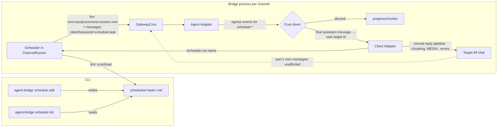

# Scheduled Tasks Spec (Cron-Triggered Agent Sessions)

## Goal

Let a user declaratively configure **scheduled tasks** that:

1. Fire on a human-friendly schedule (`every 30m`, `daily 09:00`, ...).
2. Create a **fresh, fully independent agent session** on a configured channel, with a configured working directory.
3. Send a **prompt read from a Markdown file** (so editing the task later means editing a file, not re-running a wizard).
4. Deliver the agent's **final result** into a **designated IM chat**, whose session ID the user copies from `/st` into the task file's `target` field.

The task run is completely isolated from the target chat's own session: a user chatting in that chat before, during, or after a run is never affected. The chat is only used as a delivery address.

## Non-Goals (Phase 1)

- No attachments/media in task prompts (the prompt can instruct the agent to read files itself).
- No catch-up for runs missed while the bridge was down; a missed fire is skipped.
- No context continuity between runs: every fire is a brand-new session. Continuity is achievable through the prompt (e.g. "read `last-run.md` before starting, write `last-run.md` when done").
- No streaming of task progress into the chat — only the final result (or a failure notice) is delivered.
- No full cron-expression syntax (see "Rejected Alternatives").
- No IM-side task management beyond `/schedule-run` (listing/removal happen via CLI; targeting is just editing the file).
- No tasks spanning multiple channels; a task belongs to **at most one** channel — the one named in its front-matter `channel` field (a task with no `channel` belongs to none and never fires on schedule).

## Key Design Decisions

### D1. A task run is an ephemeral session behind a synthetic clientSessionId

The scheduler fires by injecting two synthetic events through the normal ingress path:

1. `command.session.new` — `workingDirectory` from the task file (validated, see D6), `workingDirectorySource: "default"` (operator-configured paths are trusted, like the cwd fallback; the agent-side allowlist does not apply), and, when the task pins one, a `model` override that rides the event into `createAgentSession` (see the per-task model design spec, `docs/scheduled-task-model-spec.md`).
2. `user.message` — the Markdown body of the task file, verbatim.

Both events carry a **synthetic clientSessionId** of the form `schedule:<task-name>:<run-seq>` (task names are globally unique, so the id is globally unique; the run sequence makes every run's id unique). The core treats it like any other client session — binding, session lifecycle, abort, and shutdown-on-stop all work unchanged — with two deliberate exceptions (see the Component Map): `schedule:*` bindings are kept **in memory only** (a unique id per run would otherwise grow the state file forever, and resume semantics are meaningless for ephemeral runs), and the "started a new session" confirmation is **suppressed** for them (it would be mistaken for the task result). The id never collides with a real chat's clientSessionId, so **the target chat's own session binding is never touched**. This synthetic-session machinery (divert, memory-only bindings, orphan guard, suppressed confirmation) was later generalized to `queue:*` ids for event queues (see `docs/event-queue-spec.md`).

### D2. Result delivery borrows the client adapter's egress path

Output events for the synthetic `schedule:*` session cannot be delivered as-is (there is no real chat behind that id), and we do not want per-chunk streaming anyway. The divert lives in `GatewayCore.#handleAgentOutput` — the only place that knows the agentSession→clientSession mapping — in cooperation with the scheduler:

- Any output event whose resolved clientSessionId starts with `schedule:` is handed to the scheduler instead of `imAdapter.input`.
- Intermediate/progress events (tool calls, thinking, the "started new session" confirmation, ...) are discarded.
- `assistant.message` is the completion signal: the scheduler delivers it by emitting a normal `assistant.message` egress event through `imAdapter.input`, addressed to the task's **`target` clientSessionId** (from the front matter), prefixed with a localized one-line header identifying the task (e.g. `📋 Scheduled task "daily-report":`). Client adapters resolve the target chat from the clientSessionId alone (e.g. Feishu's `parseFeishuSessionId`), so no binding lookup is needed and the chat's own session state is never touched.

Because delivery goes through the standard egress event path, message chunking, `MEDIA:` attachment claiming, and formatting all behave exactly like a normal agent reply — for free.

Failure delivery:

- Agent-side failure during a run → the terminal `error` event is diverted and delivered to the target chat as a localized "task failed" message (also completing the run).
- Timeout kill (D5) → a localized "task timed out" notice is delivered the same way.
- Fire-time validation failure (D6) → no session is created; a localized error is delivered to the target chat the same way and logged.

There is deliberately **no persisted run history or CLI-side observability**: every outcome already lands in the target chat as a message (result, failure, or timeout notice), which is the user's notification surface.

If the task has no valid `target`, nothing can be delivered; the fire is skipped, logged, and shown as "no target" in `schedule list`.

The scheduler injects its synthetic events through a new public `GatewayCore.input(event)` — the exact same handler the client adapters' messages flow through, including the shutdown guard.

### D3. Tasks are Markdown files with front matter

Location: `~/.config/agent-bridge/schedules/<task-name>.md` — a **flat, channel-agnostic shared directory** (all channels' tasks live side by side; ownership lives in each task's `channel` front-matter field, not in the directory layout). The legacy per-channel `schedules/<channel>/` layout is no longer read and there is no migration: old files simply stop being scheduled.

```markdown
---
schedule: daily 09:00
directory: ~/reports
timeout: 30m
enabled: true
channel: feishu-dev
target: feishu:dm:oc_6f9d408e630098e6dd06bb071d6b60fc
model: azure-openai-responses/gpt-5.6-terra
---

Read the logs in the current directory and produce a summary of
yesterday's errors. (This is the example prompt — replace it.)
```

- Front matter is a **flat `key: value` subset** parsed by a small in-repo parser (no YAML dependency). Rules: one key per line, `key: value`, values are bare strings (surrounding quotes stripped), `#` comments and blank lines allowed, unknown keys → warning, malformed file → task disabled and reported by `schedule list`.
- The body (everything after the closing `---`, trimmed) is the prompt. It must be non-empty at fire time, otherwise the fire fails per D2.
- The file name (without `.md`) is the task's **globally unique** key: lowercase `[a-z0-9-]+`, enforced by the CLI wizard.

Front matter keys:

| Key | Required | Default | Meaning |
| --- | --- | --- | --- |
| `schedule` | yes | — | Schedule grammar string (D4) |
| `directory` | no | bridge process cwd | Working directory of the new session (`~` expanded, relative → bridge cwd, canonicalized at fire time) |
| `timeout` | no | `10m` | Max run duration (`<n>m` / `<n>h`); the run is killed when exceeded (D5) |
| `enabled` | no | `true` | `false` pauses the task without deleting it |
| `target` | no | — | Delivery address: the clientSessionId of the destination chat, copied from `/st` in that chat or set by `/schedule-here` (D7). Missing/invalid → fire skipped, logged, shown by `schedule list` |
| `channel` | no | — | Owning channel config name, written by `/schedule-here` alongside `target` (D7). A scheduler fires on schedule only tasks whose `channel` equals its own name; a task with no `channel` never fires on schedule |
| `model` | no | — | Optional per-task agent model override (design spec `docs/scheduled-task-model-spec.md`): only this task's own runs use it — the channel's chat sessions are unaffected on pi, and on opencode chat `/new` only gains the same `assertModelAvailable` check against the channel config model (one extra provider round-trip; see the design spec). Precedence: task `model` > channel agent config's `model` > env/adapter default. Blank or absent = the channel agent config's model. Parsing only checks for a non-empty string; validity is enforced at fire time by the adapter: **pi** passes it to the pi process as `--model` at spawn (an invalid model makes the process fail at startup), **opencode** runs its availability check against the effective (override-first) model and refuses to create a session. Applies to scheduled fires and `/schedule-run` alike, since both share one fire path. |

### D4. Schedule grammar (simplified, zero-dependency)

Four forms, local timezone of the bridge process, minute granularity:

```
every <n><unit>          unit: m (minutes) | h (hours) | d (days); n >= 1; anchored at scheduler start
daily HH:MM              every day at wall-clock time
weekly <day> HH:MM       day: mon..sun (case-insensitive)
monthly <day-of-month> HH:MM   1..31; short months clamp to their last day
```

Implementation: a pure `nextRun(schedule, from: Date): Date` function plus a tick loop. Parsing and next-run computation are fully unit-testable with an injected clock. Invalid strings are rejected at `schedule add` time (re-prompt) and disable the task at load time.

### D5. Run lifecycle: completion or timeout — no overlap policy

Every fire unconditionally starts a **fresh, fully isolated run**; runs never interact, so no mutual-exclusion configuration is needed. A run ends for exactly one of two reasons:

1. **Completion** — the diverted `assistant.message` (or terminal `error`) arrives; the result/failure is delivered per D2 and the run is done.
2. **Timeout** — the run exceeds the task's `timeout` (default `10m`): the scheduler aborts the run's `schedule:<task>:<seq>` session, releases it, and delivers a localized "task timed out" notice to the target chat.

Consequence to document: if the schedule interval is shorter than the timeout (e.g. `every 1m` with `timeout: 30m`), several runs of the same task can be alive concurrently. Because each run has its own synthetic session id, they are genuinely isolated (results can never cross), but concurrency costs resources — the docs recommend choosing an interval comfortably larger than the expected run duration.

A manual trigger (`/schedule-run`, D7a) behaves identically to a scheduled fire — it starts a fresh run through the same fire path, no special-casing; the only difference is which tasks each path selects: the tick filters by `channel`, while `runNow` can also fire a task that has no `channel` (see D7a/D8).

### D6. Validation and failure behavior at fire time

Synthetic events bypass the client adapters, so the adapters' `/new <path>` pre-validation does not apply. The scheduler therefore reuses the shared `validateWorkingDirectory` util before injecting:

- Invalid `directory` or empty prompt → **nothing is injected**; handled per D2 (error to the target chat + log).
- Failures *after* injection that surface as **agent output** (run-time agent errors, ...) are diverted/delivered per D2.
- **Per-task `model` validation is NOT part of this fire-time check.** It happens inside the adapters when `createAgentSession` runs (pi: at spawn via `--model`, fail-fast when the process exits; opencode: `assertModelAvailable` on the effective model, throws before any session is created). When the model is invalid/unavailable the session-new dispatch resolves `{ ok: false, reason }` (the core ingress never rejects), the scheduler **ends the run without dispatching the follow-up `user.message`**, delivers a `schedule.taskFailed` notice with the adapter's error detail to the task's `target` chat, and reports the real reason to `/schedule-run` — there is **no fallback** to the channel default model (T6; see `docs/scheduled-task-model-spec.md` §Failure semantics). Chat-originated `/new` failures keep their localized notice in the chat, unchanged.

### D7. Targeting a chat: `/schedule-here` for the initial bind, `target` + `/st` for edits

Problem: IM chat/session IDs (`feishu:dm:oc_6f9d...`) are not user-guessable, so the destination chat needs a discovery path.

**Initial setup — `/schedule-here <task-name>`**: right after `schedule add`, the user goes to the intended destination chat and sends `/schedule-here <task-name>`. The client adapter handles it locally and calls the injected `onScheduleHere(taskName, clientSessionId)`; the bridge then **writes two front-matter lines into the task file: `target` (the chat's clientSessionId) and `channel` (this channel's config name)** (a surgical front-matter edit — only those two lines are inserted/replaced; the prompt body and other fields are untouched) and replies a localized confirmation naming the task. Unknown task name → localized error reply. The write is atomic; the hot-reload tick picks the change up like any other edit.

**Already bound → refused**: a task is considered bound when its file carries a `target` **or** a `channel` line (either is written at bind time). `/schedule-here` on a bound task is refused with the localized "already bound" reply (reason `task already bound`) — silently overwriting an existing binding would let anyone redirect a task's delivery, so rebinding is deliberately a manual edit. There is **no `/schedule-unbind` command** and no reason to add one: unbinding is a low-frequency management operation and the task file is the single source of truth — deleting the two lines is the unbind (per the "low-frequency management ops → AI edits the file" principle).

**Later changes — manual**: the **`/st` reply's "Chat session ID" line** (the event envelope's `clientSessionId`, previously undisplayed) lets the user copy any chat's id and edit the `target` line by hand. To move a bound task: edit the file (`target` → the new chat's id, `channel` → its channel config name), or delete both lines to unbind and then run `/schedule-here` again in the new chat. Unbind = delete both lines.

- There is still **no runtime binding state and no channel-state schema change** — the task file remains the single source of truth; `/schedule-here` is only a convenient way to write one line into it.
- At fire time the scheduler validates `target` with the client module's session-id parser (e.g. `parseFeishuSessionId`). Missing/malformed → fire skipped + logged + `schedule list` shows the problem (there is nowhere to deliver an error to).
- A `target` copied from a **different channel** is equally invalid (the clientSessionId prefix won't match this channel's client type) and is handled the same way.

### D7a. Manual trigger: `/schedule-run <task-name>`

So a task can be verified end-to-end right after setting `target` instead of waiting for the schedule: the adapter handles `/schedule-run <task-name>` locally and calls the scheduler's `runNow(taskName)`, which performs exactly the same fire path as a scheduled trigger (fresh isolated run, timeout-bounded, result delivered to the target chat). Unknown/disabled/no-target task → localized error reply. Any chat of the channel may trigger any of its tasks; the result always goes to the task's `target`.

**Ownership check shared with `fire`**: `runNow` and the timed tick share one fire path (`#fire`), so both enforce the same ownership rule — a task bound to a **different** channel (`channel` set to anything else) is refused with reason `task belongs to channel "X"` and the localized "Please run it from that channel" reply. A task with **no `channel`** (a legacy/manual file) is *not* refused by the ownership check: it passes to the ordinary target validation, so it can still be triggered manually from any channel whose target validation accepts its `target` — but the tick loop never selects it for scheduled firing (see D8).

IM-side schedule commands are **flat** (`schedule-run`), never `command + subcommand` — see `docs/grill-context/principles.md`.

The stored `target` is only a delivery address for D2 — the runner passes it verbatim into the egress event; the client adapter already knows how to resolve it to a chat. It grants no control over the chat's own session.

### D8. Hot reload by tick polling

The scheduler wakes on a short fixed tick (30 s), re-scans the **shared flat schedules directory** (all channels' task files), and re-syncs its in-memory task table. The table mirrors **every** task — ownership is decided at fire-selection time, not at load time:

- **Scheduled firing is filtered by the task's `channel` field**: only tasks whose `channel` equals this channel's config name fire on schedule; tasks owned by other channels and unbound tasks (no `channel`) are skipped, with `nextRun` left untouched.
- **Target claiming** (`/schedule-here`) can resolve any task by name regardless of ownership — task names are globally unique, so the existence check needs the full table.

- Edited body → used on the next fire (the file is read at fire time).
- Edited front matter → effective on the next tick; no channel restart needed.
- New/deleted files → tasks appear/disappear on the next tick. Deleting a file mid-run does not interrupt the in-flight run.
- No `fs.watch` (cross-platform unreliability); 30 s polling is cheap and predictable.

### D9. Runtime placement

One `Scheduler` instance per channel, owned by `ChannelRunner`, started/stopped with the channel; each instance scans the shared directory and fires on schedule only the tasks whose `channel` matches its own name (see D8). Stopping a channel clears timers; in-flight task sessions shut down through the normal core teardown (they are ordinary sessions behind synthetic ids). Missed fires while stopped are not made up.

## Architecture



## Storage Changes

**None.** Targeting lives entirely in task files; the channel state schema is untouched. New filesystem layout:

```
~/.config/agent-bridge/
  config.json
  session-bindings/<channel>.json      # unchanged (v3)
  schedules/<task>.md                  # new — flat, channel-agnostic; ownership lives in each task's `channel` front matter
```

## CLI Surface

```
agent-bridge schedule add       # interactive wizard — no channel selection (task names are globally unique)
agent-bridge schedule list      # global list: Channel, Task, Schedule, Enabled, Target, Next run (computed from the grammar), Status
agent-bridge schedule remove <task-name>   # direct delete — no --channel option (task names are globally unique)
```

Wizard steps for `add`:

1. Task name (slug-validated, globally unique — no channel selection).
2. Schedule string (validated against the grammar, re-prompt on error, with examples shown).
3. Working directory (optional; blank = bridge cwd). Not validated against the filesystem here — validation happens at fire time (D6), since the bridge may run elsewhere.
4. Timeout (duration string, default `10m`).
5. Model (optional; blank = the channel agent config's default model. The CLI does not validate it — it cannot reach the provider's model list; an invalid model is fail-fast rejected by the adapter when the session is created, which fails the whole fire: the run ends, a `schedule.taskFailed` notice with the error detail is delivered to the task's `target` chat, and there is no fallback to the default model (see D6). A non-empty value is written as the `model:` line).
6. Writes the file with a localized example prompt body (a trivial time-telling task, in the CLI's default locale — no channel is selected to localize by), then prints the file path and the targeting instruction: *"Edit the file to set your prompt. To choose the destination chat, send `/schedule-here <task-name>` in that chat (later changes: `/st` shows the chat session ID for manual `target` edits)."*

## Component Map

| Area | Change |
| --- | --- |
| `src/config/paths` (or `channel-state.ts`) | Add `SCHEDULES_DIR` |
| `src/modules/schedule/grammar.ts` | Schedule parser + `nextRun(schedule, from)` |
| `src/modules/schedule/task-file.ts` | Front-matter subset parser, task loader/validator (incl. `target` shape per client module; parses optional `model`, non-empty-string-when-present, no load-time validation) |
| `src/types.ts` | `command.session.new` gains optional `model`; `AgentModule.createAgentSession` options gain optional `model` |
| `src/modules/schedule/scheduler.ts` | Tick loop, task table sync, run registry, fire injection (rides `model` onto the synthetic `command.session.new`), timeout enforcement |
| `src/core/gateway-core.ts` | Public `input(event)` ingress for synthetic events; divert `schedule:*` output to the scheduler instead of the IM adapter |
| `src/core/channel-runner.ts` | Own/START/STOP scheduler; wire scheduler ↔ core; expose `runNow` to the client adapter |
| `src/modules/client/utils/slash-commands.ts` | Parse `/schedule-run <name>` (adapter-local command, never reaches the core) |
| `src/modules/client/utils/status-markdown.ts` | Render one extra `/st` line: the chat's clientSessionId ("Chat session ID") |
| 3 IM adapters | Handle `/schedule-run` via injected callback + localized replies |
| `src/modules/agent/*` | pi-coding-agent: passes `model ?? config.model ?? PI_MODEL` to the pi process at spawn; opencode: asserts the effective (override-first) model and creates the provider session with it |
| `src/cli.ts` + `src/config/prompt.ts` | `schedule add/list/remove` (+ optional Model wizard step)
| `src/i18n/index.ts` | `/st` chat-session-ID label, task result header, task failure/timeout notices, `/schedule-run` replies, CLI strings |
| `docs/scheduled-tasks.md` | User documentation (grammar, file format, targeting via `/st`, isolation semantics) |

## Edge Cases

- **User chats in the target chat while a task runs** → fully independent; the user's session and the task's `schedule:*` session never interact.
- **Moving delivery to another chat** → edit the `target` line; effective on the next tick. No command needed.
- **`target` copied from a different channel / typo'd** → fails the client module's session-id parse at load/fire time; fire skipped, logged, shown by `schedule list`.
- **Task file deleted while a run is in flight** → run completes and delivers normally; no future fires.
- **Target chat deleted IM-side** → delivery fails through the existing egress error handling and is logged.
- **Two channels, same task name** → impossible by construction: task names are globally unique (one file per name). A task belongs to the channel named in its `channel` field, and each channel's scheduler fires only its own tasks.
- **Task with no `channel` (legacy/manual file)** → never fires on schedule (every scheduler's tick skips it), but it can still be triggered manually via `/schedule-run` from any channel whose target validation accepts its `target`; the ownership check refuses only tasks bound to a different channel.
- **Channel restarted mid-run** → the ephemeral session is torn down like any session; the run is lost (no resume in phase 1). `schedule:*` bindings live in memory only, so a restart leaves no residue in the state file.
- **Clock jumps / DST** → `nextRun` recomputes from wall clock every tick; `daily 09:00` fires at the next local 09:00 whatever happened in between. A fire is considered due when `now >= nextRun`; at most one fire per task per tick (no bursting).
- **Result is empty or only whitespace** → deliver a localized "task finished with no output" notice instead of silence.

## Testing Plan

- Grammar: parse + `nextRun` across all four forms, clamping (`monthly 31` in February), invalid strings, DST boundary (fixed clock).
- Front-matter parser: happy path, comments/quotes, unknown keys, malformed files, empty body.
- Scheduler: fake clock + fake runner — fire injection order and event payloads, hot reload (edit/disable/delete), timeout kill (abort + timeout notice delivered), fire-time directory validation failure (no injection, error delivered).
- Runner/core divert: schedule-session progress events dropped; `assistant.message` delivered to the task's `target` with header and completing the run; terminal `error` delivered as failure; non-schedule sessions untouched; the target chat's own binding never modified.
- Channel state: unchanged (assert no scheduler writes).
- `/schedule-run`: adapter-level test (Feishu) — success and error paths; `/st` renders the chat session ID line.
- CLI: wizard validation loops (schedule string, task name), file creation shape.
- Manual e2e on the `feishu-dev` channel: add → copy `/st` id into `target` → edit prompt → `/schedule-run` → verify result message arrives while a parallel interactive conversation in the same chat keeps its session intact; verify timeout kill with a short `timeout` and a slow prompt.

## Rejected Alternatives

| Alternative | Why rejected |
| --- | --- |
| Firing the task as `/new` + prompt **on the target chat's own session** | Maximum pipeline reuse, but every fire resets the chat's session — a user mid-conversation gets silently `/new`'d. Unacceptable UX; isolation is a hard requirement. |
| Bind code + `/schedule-bind` runtime binding | Superseded by the `target` field + `/st` discovery: copy-paste rides the hot-reload mechanism, needs no runtime binding state, no channel-state migration, and no adapter callback plumbing. Editing a line covers bind/rebind/unbind. |
| Per-task overlap policy (`skip`/`queue`/`restart`) | A three-way state machine for a problem that isolation + a timeout bound eliminates. Runs end by completing or by being killed at `timeout`; fires always start fresh. |
| Full cron expression syntax | Users can't remember it; needs a dependency or a non-trivial parser (seconds field, DST). The four-form grammar covers the realistic cases and is unit-testable in one pure function. Can be added later without breaking the file format. |
| Prompt typed into the CLI wizard | Multi-line prompts in a terminal wizard are painful and un-editable afterwards. Files are diffable, git-trackable, and hot-reloaded. |
| Bind code stored in channel state by the CLI | (Historical, when the bind-code design was still live) cross-process write race with the running bridge — single-writer assumption on state files. Moot now that runtime binding is gone entirely. |
| `fs.watch` hot reload | Unreliable across platforms/editors (atomic-save patterns); 30 s tick polling is simpler and predictable. |
| Streaming task progress into the chat | Spams a chat that belongs to a human; the final result is the deliverable. A start-notice option may be added later if wanted. |
| Catch-up runs after downtime | Surprising side effects on restart; skip-and-continue is predictable. |
